# Social Media Analytics in R

Taking a look at data of 1.6 million twitter users and drawing useful insights while exploring interesting patterns. The techniques used include text mining, sentimental analysis, probability,time series analysis and Hierarchical clustering on text/words.

 

	

## 1.1 Data Description

We use two different files in our data sets:

1. The *tweets.csv* data set contains 1.6 million tweets with 6 fields as follows:

- target: the polarity of the tweet (0 = negative, 2 = neutral, 4 = positive)
- ids: The id of the tweet ( 2087)
- date: the date of the tweet (Sat May 16 23:58:44 UTC 2009)
- flag: The query (lyx). If there is no query, then this value is NO_QUERY.
- user: the user that tweeted (robotickilldozr)
- text: the text of the tweet (Lyx is cool)

2. The *daily-website-visitors.csv* contains 5 years of daily time series data for several measures of traffic with 2167 records and 8 Columns:

- Row: Unique row number for each record
- Day: Day of week in text fomr (Sunday, Monday, etc)
- Day.Of.Week: (Day of week in numeric form (1-7))
- Date: Date in mm/dd/yyyy format
- Page.Loads: Daily number of pages loaded
- Unique.Visits: Daily number of visitors from whose IP addresses there haven't been hits on any page in over 6 hours
- First.Time.Visits: Number of unique visitors who do not have a cookie identifying them as a previous customer
- Returning.Visits: Number of unique visitors minus first time visitors

## 1.2 Data Acquisition

We acquire both the data sets from Kaggle:

1. https://www.kaggle.com/kazanova/sentiment140

2. https://www.kaggle.com/bobnau/daily-website-visitors

# 2. Analytical Questions 

## 2.1 Text Mining

### Finding the frequently used unique words

	<a href="#">
		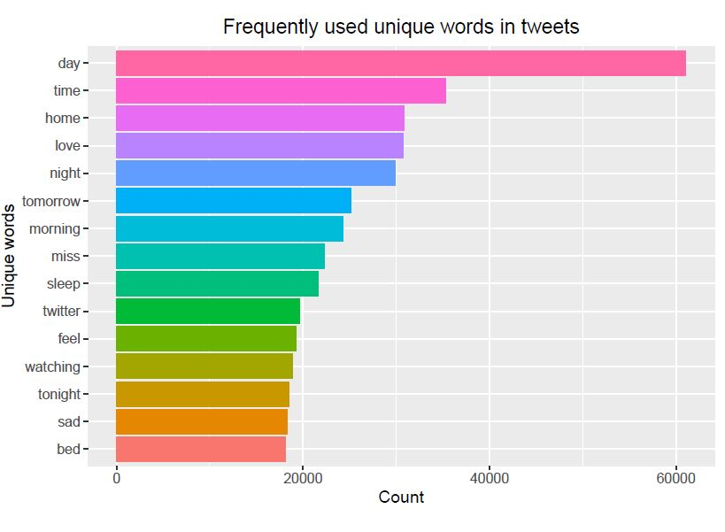
	</a>

For this insight, we consider only the original thought of the user/author. We Remove stop words, username mentions, replies, and Re-tweets so that we only have the “original” tweets and visualize our findings. 

**Observation:** Day is the most frequently used word which has been used around 63,000 times out of the total of 1.6 million tweets. Following that, the words Time, Home, love and night have been used around 30,000 times each.

### Sentimental Trends of Tweets

	<a href="#">
		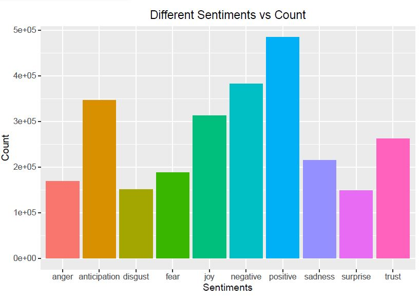
	</a>

By utilizing the nrc library, we find different sentiments in each of the tweets and visualize their counts.

**Observation:** Positive, negative, anticipation are the top three most tweeted sentiments. Another trend is that there are equal number of Anger, disgust and surprise sentiment tweets. A lot of Users have also tweeted about issues that they fear and trust.

## 2.2 Clustering Analysis

### Hierarchical clustering words by sentiments

	<a href="#">
		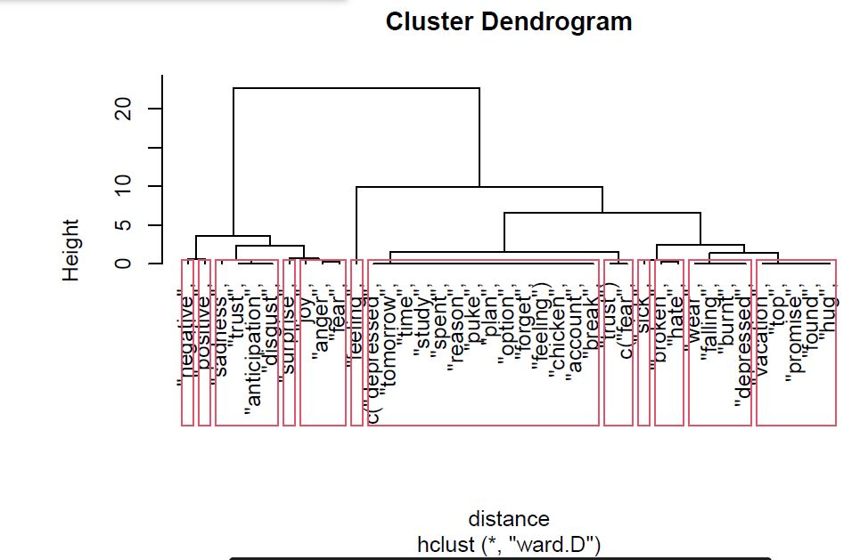
	</a>

Since our data set comprises of text data, we make a corpus and utilize Hierarchical clustering technique. This technique gives us a dendrogram of different words grouped together by sentiments. The number of clusters in hierarchical clustering is given as a range while trying to plot it. Using the suggested range, we
can chose the number of clusters. We have chosen to go with 12 as the number of clusters.

**Observation:** The above Dendrogram clusters our sample space into 12 clusters grouped by sentiments. The height of the Dendrogram signifies the distance between the clusters.

## 2.3 Probability

### Calculating the Probability Mass Function (PMF) and Cumulative Distribution Function (CDF) of tweet frequency.

|    PMF    |
|:---------:|
| 0.1307690 |
| 0.1087685 |
| 0.1058048 |
| 0.0932933 |
| 0.0937506 |

|    CDF    |
|:---------:|
| 0.1307690 |
| 0.2395376 |
| 0.3453424 |
| 0.4386357 |
| 0.5323863 |

### Probability Mass Function over Time

	<a href="#">
		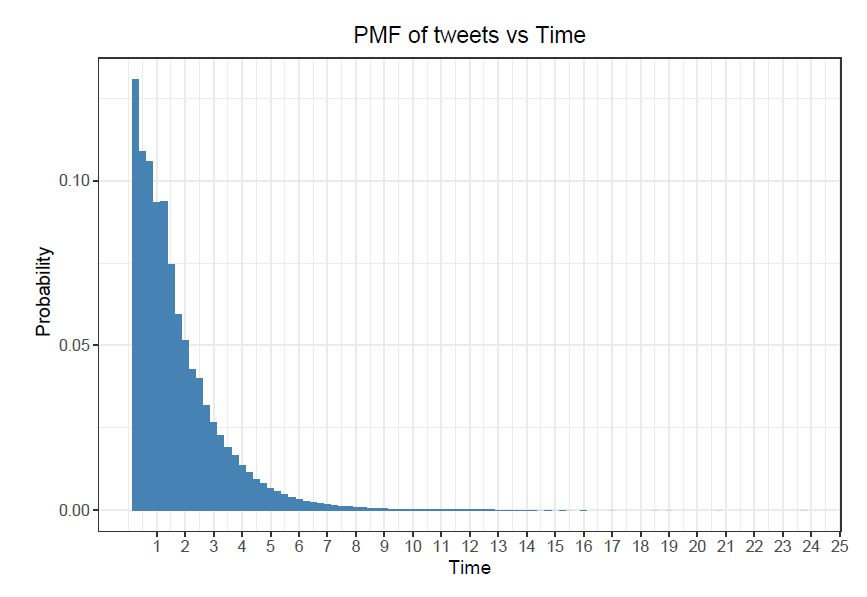
	</a>

**Observation:** The probability of tweets is reducing over time in an exponential scale for a given period. The probability is highest in the start of the time chosen.

## 2.4 Time Series

### Trend analysis for different sentiments for each day of the week.

	<a href="#">
		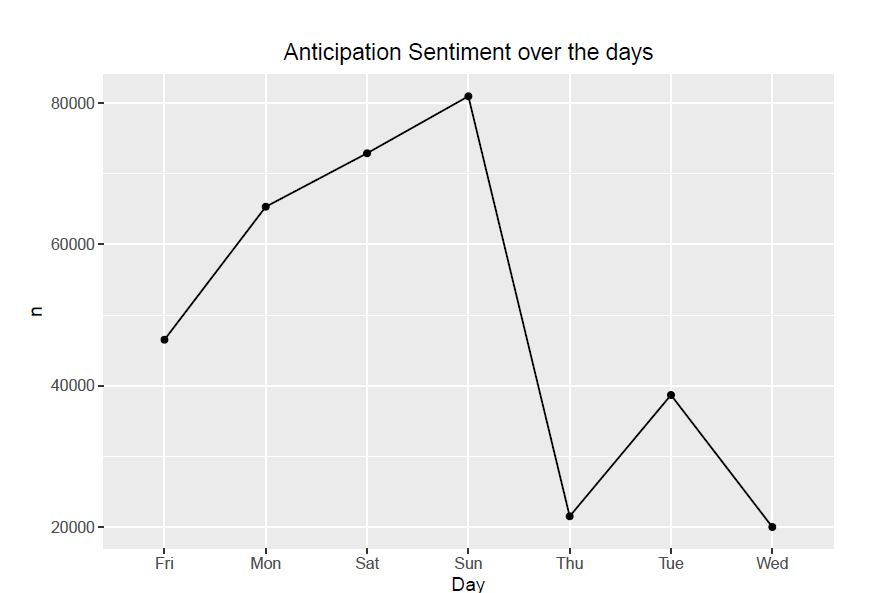
	</a>
	 
	<a href="#">
		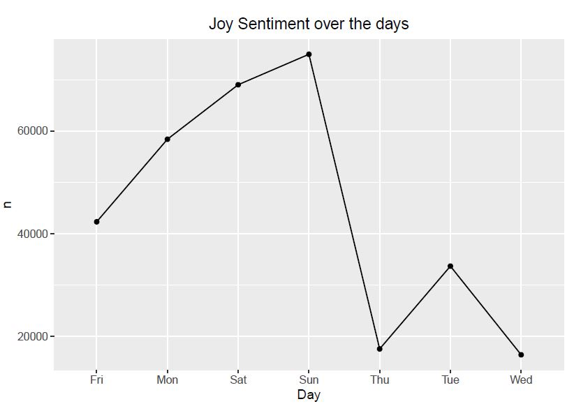
	</a>
	 
	<a href="#">
		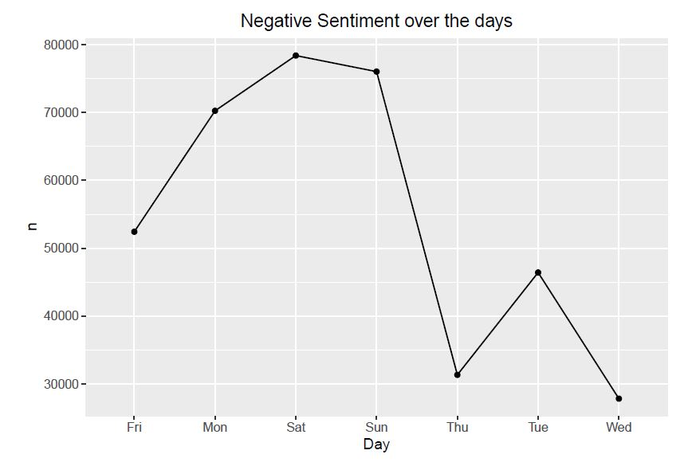
	</a>
	 
	<a href="#">
		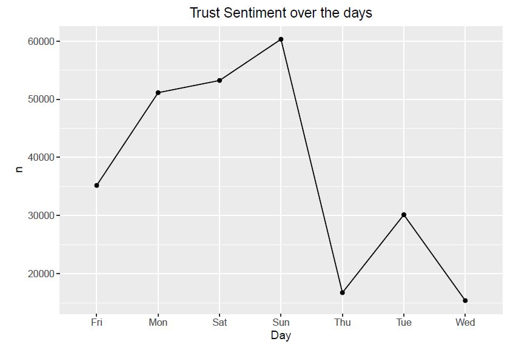
	</a>
	 
	<a href="#">
		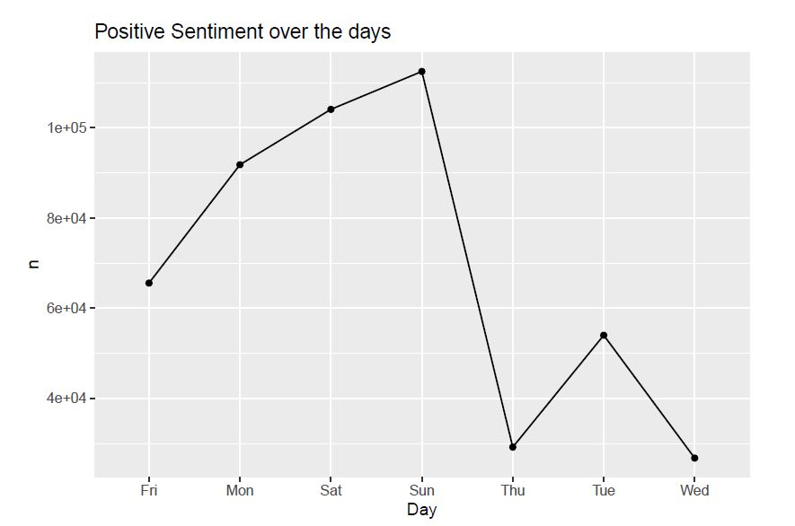
	</a>

**Observation:** From all the above graphs, we observe that positive sentiments of tweets increases till Sunday and then drastically decreases afterwards. The negative sentiments starts increasing till Saturday and then decreases. The other sentiments shown the graphs also follow a similar pattern to that of postive sentiment.

### Trend analysis looking at number of tweets per day of the week

	<a href="#">
		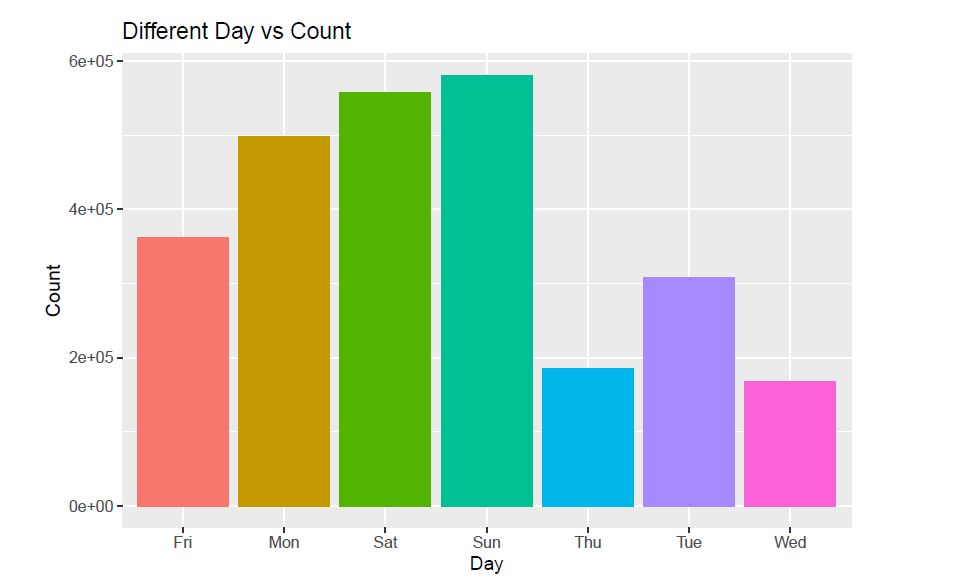
	</a>

**Observation:** Top three days for tweeting are Saturday, Sunday and Monday which should be inline with the start of the weekend and the work week. Meanwhile Wednesday and Thursday have the lowest number of tweets as it’s in the middle of the week.

### RQA (Reccurence Quantification Analysis)

	<a href="#">
		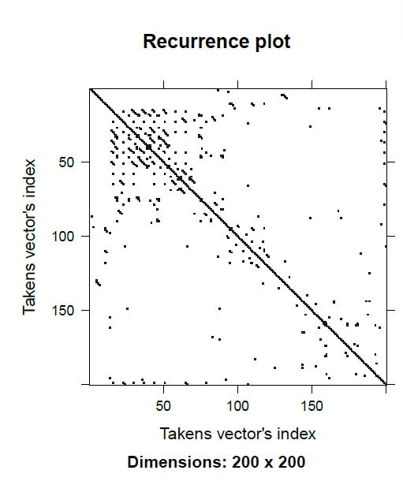
	</a>

**Observation:** From the RQA graph, it is observed that there are single isolated points. This can be interpreted as heavy fluctuation and the process may be an uncorrelated random or even anti-correlated process. Therefore, the number of page loads and the texts in the tweets are uncorrelated.

### Computing Degree of Permutation Entropy and Complexity

	<a href="#">
		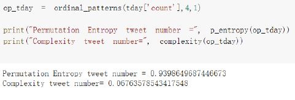
	</a>

**Observations:** The permutation entropy is so high and the complexity near to zero. This means that there is no relationship between the dates and the day.

### Number of Tweets per day over a period of 3 Months

	<a href="#">
		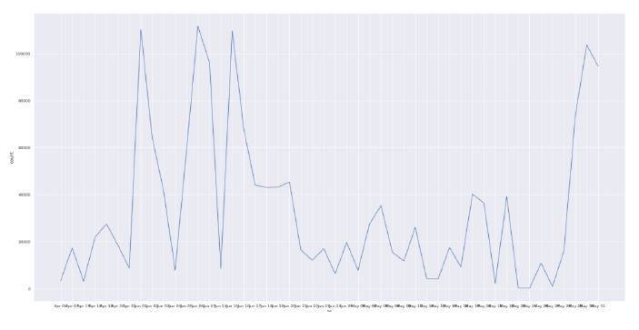
	</a>

**Observation:** The trend of the number of tweets in three months. During may the trend changes dramatically and there are three highest number of tweets in may.

# 3. Report

After conducting our analysis with the available data, we visualize and answer all of the above Analytical questions and consolidate them into the following concise report: [PDF](https://github.com/Thomas-George-T/Social-Media-Analytics-in-R/blob/main/Social-Media-Analytics.pdf)

# 4. Summary

After careful analysis of 1.6 million worth of twitter data, We were able to decipher lot of emerging patterns and visualize them. We were able to gain valuable insights about our business questions through various plots,text analysis/mining, clustering, probability and time series data.
